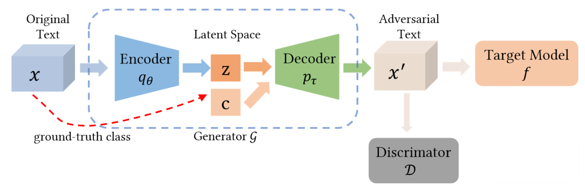
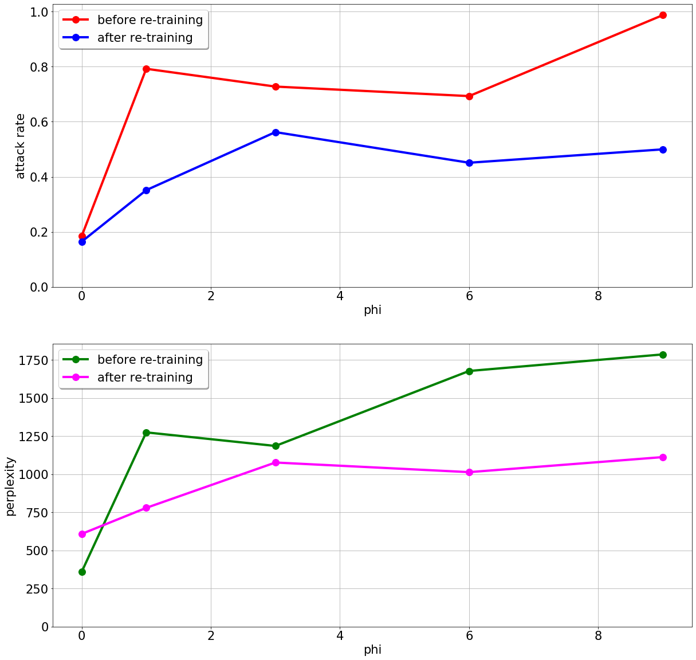

## Generating Natural Language Adversarial Examples on a Large Scale with Generative Models

An open-source Pytorch implementation [Generating Natural Language Adversarial Examples on a Large Scale with Generative Models](https://arxiv.org/abs/2003.10388)  paper

### Links and References:
-  https://github.com/leohsuofnthu/Pytorch-TextCNN
-  https://github.com/wiseodd/controlled-text-generation

### Project Structure
- TextCNN - scripts to train TextCNN (required to run pipeline)
- VAE - scripts to train VAE (not needed to run the pipeline, it is included separately)
- notebooks - an end-to-end pipeline for training proposed model
- datasets - torchtext based dataloaders
- scripts - some helpful scripts 

### Requirements:
- Torch >= 1.0.
- Torchtext
- Spacy
- default data science libraries NumPy, SciPy, Pandas, Matplotlib, etc. 

All libs should be available via pip or conda,

For Spacy don't forget to download a language model, python -m spacy download en_core_web_sm

In case of any issues, please contact us by: 
- email:  Konstantin.Sozykin (dot) skoltech.ru, Nikita.Stroev (dot) skolkovotech.ru
- telegram @Konstantin.Sozykin 

Also dataset and trained weights are available here:

https://yadi.sk/d/420Wdc6M7Y3cgg

you can extract it into ./notebooks folder
